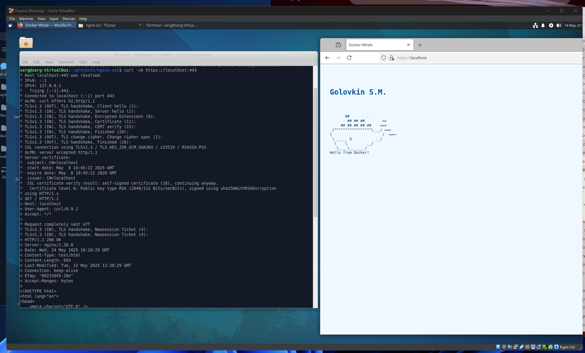
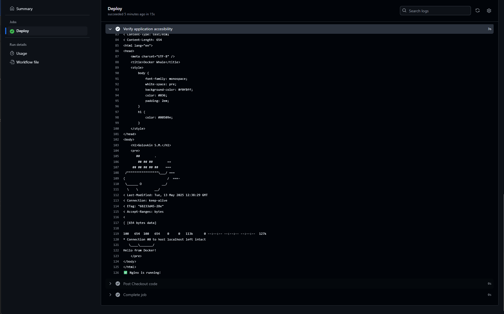
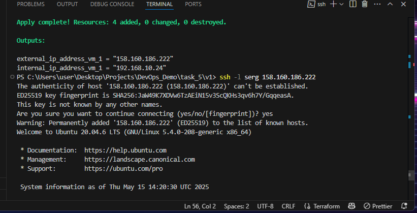
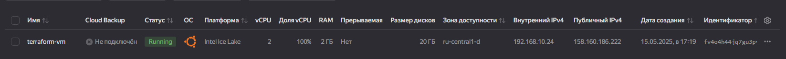

В этом репозитории представлены четыре задания, выполненные в отдельных папках (task_1, task_2, task_3, task_4, task_5). Для каждого задания ниже приведено краткое описание и соотвестующие заданию скриншоты.
В основном работал в гипервизоре VM Oracle с следующими машинами: main(controller) host with Xubuntu 24.10, target host with Xubuntu 22.04. Основная ОС: Win11   

Задание 1: Ansible-плейбук для установки и настройки nginx

    Написан Ansible-плейбук для автоматической установки и настройки веб-сервера nginx.

    Используются переменные и шаблоны для конфигурации.

    Плейбук:

        Устанавливает пакет nginx.

        Настраивает конфигурационный файл через шаблон.

        Запускает сервис nginx.

        Проверяет доступность сервера по HTTP/HTTPS.

    В качестве ОС использована Ubuntu 22.04.

    Скриншот/лог выполнения плейбука:

    Код плейбука и шаблоны находятся в папке task_1.

Задание 2: Dockerfile и docker-compose для nginx с HTTPS

    Создан Dockerfile для сборки образа nginx с самоподписанным сертификатом.

    В docker-compose.yaml добавлен сервис nginx с монтированием статической HTML-страницы как volume.

    Конфигурация nginx:

        Сервер работает на порту 443 (HTTPS).

        Осуществляется редирект с 80 на 443.

        Используется самоподписанный сертификат.

        Отдается статическая страница.

    В итоговый образ входят:

        Конфиг nginx, самоподписанный сертификат, его ключ.

    Автозапуск контейнера при рестарте ОС.

    Открыт порт для доступа с локального хоста.

    Скриншот или вывод команды curl:

    Все необходимые файлы находятся в папке task_2.

Задание 3: Bash-скрипт для мониторинга диска и отправки алерта на почту

    Написан bash-скрипт для проверки занятого объема диска.

    Если свободно менее 15%, отправляется уведомление на почту.

    Все параметры (SMTP-сервер, логин, пароль, email) вынесены в переменные.

    Используется отправка через публичный SMTP (Yandex, Mail.ru, Gmail).

    Скрипт не содержит личных данных для авторизации.

    Скрипт находится в папке task_3.

Задание 4: CI/CD пайплайн для сборки и доставки контейнера

    Реализован пайплайн в (указать систему, например, GitHub Actions или GitLab CI).

    Этапы:

        CI: Сборка контейнера из Dockerfile задания 2.

        CD: Доставка и запуск контейнера на сервере.

    Использованы инструменты Github Actions, self-hosted runner in Ocale VirtualBox.

    Отчет о выполнении пайплайна версия 1:

=====================================================

=====================================================

    Отчет о выполнении пайплайна версия 2:

=====================================================

=====================================================

    Конфигурационные файлы пайплайна находятся в папке task_4.

Задание 5: Создание облачной инфраструктуры в Yandex Cloud с помощью Terraform

    Использован провайдер Yandex Cloud для Terraform.

    Созданы необходимые ресурсы:

        Виртуальная сеть (VPC) и подсеть.

        Загрузочный диск с образом Ubuntu 22.04 LTS.

        Виртуальная машина с параметрами, определенными в переменных терраформ.

    Настроена сеть с NAT для доступа к ВМ.

    Использован файл meta.txt для передачи SSH-ключа через метаданные.

    Скриншоты из панели управления Yandex Cloud, подтверждающие создание ресурсов:

=====================================================

    
Конфигурационные файлы Terraform и вспомогательные файлы находятся в папке task_5.

    В версии 2 проекта terraform при запуске комманды terraform init получаю ответ:
    
    <some_home_dir> terraform init
    Initializing the backend...
    Initializing modules...
    Initializing provider plugins...
    - Reusing previous version of yandex-cloud/yandex from the dependency lock file
    - Finding latest version of hashicorp/yandex...
    - Using previously-installed yandex-cloud/yandex v0.141.0
    ╷
    │ Error: Failed to query available provider packages
    │ 
    │ Could not retrieve the list of available versions for provider hashicorp/yandex: provider
    │ registry.terraform.io/hashicorp/yandex was not found in any of the search locations
    │
    │   - provider mirror at https://terraform-mirror.yandexcloud.net/
    ╵ 
